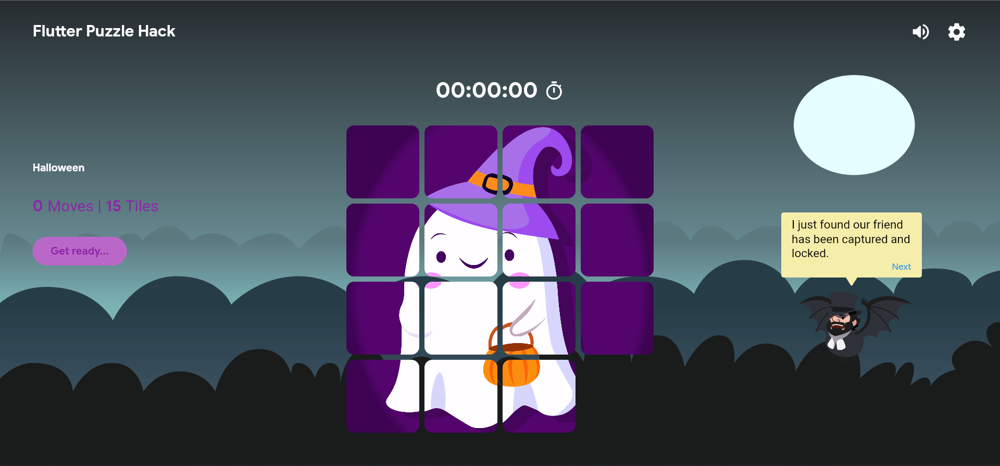
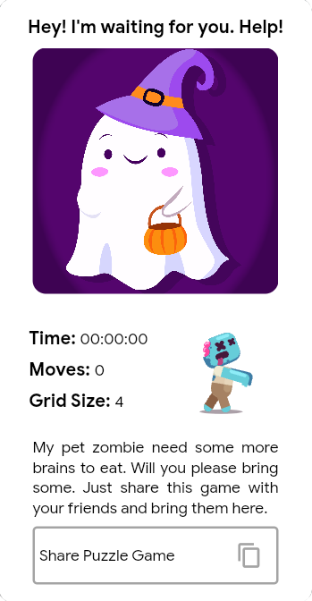

# Flutter Puzzle Hack 2K22

This application is not made from scratch but I have modified the existing sample slide puzzle codebase. See references for more info.

What I have added in the existing codebase?
1. &nbsp;Cool Animations
2. &nbsp;Anchor, who guides a player throughout the game
3. &nbsp;Stories
4. &nbsp;And functionality to change grid size on the fly (Tile assets not required anymore).

If you're reading this you probably wanna see a live version of the application. Just [click-here...](https://slide-puzzle-6ac4a.web.app/)

&ensp;<br>

## Test Locally
I have used only [flutter_gen](https://pub.dev/packages/flutter_gen) package as an additional dependency which may require you to setup some things. This package generates assets, so I won't make any mistakes typing their absolute paths to the assets directory. Its pretty easy to install [flutter_gen](https://pub.dev/packages/flutter_gen) package, just follow their installation docs.

Environment Details-
1. Windows 11
2. SDK '>=2.16.0-134.5.beta <3.0.0'
3. Flutter version 2.10.0-0.3.pre
4. Dart version 2.16.0 (build 2.16.0-134.5.beta)

If you're adding new assets you may want to generate Assets class for those assets like I did with flutter_gen package, just run following command from the root directory of the application.
```
flutter packages pub run build_runner build
```

## Internalization
This application can support multiple languages, but for now it supports only english. All application resource bundle files are placed inside *assets/l10n* folder.

**Note:** Using VSCode and seeing linter errors for AppLocalizations? I faced this issue as well, just make sure you have ran <code>flutter pub get</code> command once, now either restart your *editor* or *restart dart analysis server* from command palette, and you're good to go.

## Platforms

I have successfully tested the application for the following platforms.

1. &nbsp;Android 10 and 11
2. &nbsp;Web - Edge, Chrome and Brave
3. &nbsp;Desktop - Windows

**Note:** Windows platform don't support *audio* with *just_audio* package for now.

## References-
Sample Puzzle Game: [flutter.github.io/samples/web/slide_puzzle](https://flutter.github.io/samples/web/slide_puzzle/) <br>
Sample Codebase: [github.com/VGVentures/slide_puzzle](https://github.com/VGVentures/slide_puzzle)

## Find me around web: 

- Sharing amazing articles on <a href="https://priyank-kumar-singh.medium.com/">Medium</a> 📰
- Sharing updates on <a href="https://www.linkedin.com/in/priyank-kumar-singh-705/">LinkedIn</a> 💼

[](https://twitter.com/priyankkumars18)
[](https://www.linkedin.com/in/priyank-kumar-singh-705/)
[](https://github.com/priyank-kumar-singh)
